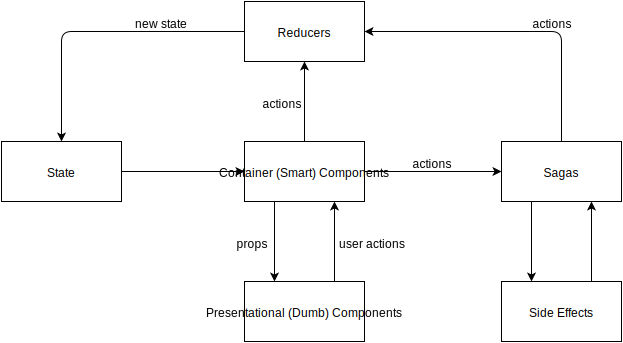

# react-app-structure
> React web app structure.

## Table of Contents
- [Install](#install)
- [Usage](#usage)
- [Developer Guide](#developer-guide)
  - [Linting and Code Formatting Conventions](#linting-and-code-formatting-conventions)
  - [Inspecting and Debugging](#inspecting-and-debugging)
- [Developer Tools](#developer-tools)
  - [Storybook](#storybook)
  - [Blueprints](#blueprints)

## Install
Install yarn and run
``` bash
yarn
```

## Usage


### Running the web app
```bash
yarn start
```

## Developer Guide
1. React: https://reactjs.org/
2. React-Router: https://reacttraining.com/react-router/web/example/basic
3. Redux: http://redux.js.org/
4. Saga: https://github.com/redux-saga/redux-saga
5. Reselect: https://github.com/reactjs/reselect

### Linting and Code Formatting Conventions
ESLint with [eslint-config-airbnb](https://www.npmjs.com/package/eslint-config-airbnb).

### Inspecting and Debugging
We can use two tools:
#### Chrome Debugger
Use extension for redux, https://github.com/zalmoxisus/redux-devtools-extension.

#### Reactotron
https://github.com/infinitered/reactotron.

## Developer Tools
### Storybook
Helps to build components independently: https://storybook.js.org/basics/quick-start-guide/.

### Blueprints

Generate a new dumb component / HOC Component (that has access to state)/ redux duck (actions/reducers) by using [redux-cli](https://github.com/SpencerCDixon/redux-cli)

```bash
npm install -g redux-cli
```
After installing, we can:

* generate duck file
```bash
redux g duck <name>
```
* generate container (smart) component
``` bash
redux g smart <name>
```

* generate dumb component
```bash
redux g dumb <name>
```


## References
* duck-modular-redux: https://github.com/erikras/ducks-modular-redux
* smart vs dumb components: https://medium.com/@dan_abramov/smart-and-dumb-components-7ca2f9a7c7d0
## App Architecture


* Container components (**containers** folder): connect with redux store and dispatch actions to sagas or reducers.
* Dumb components (**components** folder): mainly describe UI, base on props, which are passed from container.
* Reducers (**store/reducers** folder): Receive actions (from sagas or containers) and return new state.
* Sagas (**store/sagas** folder): Listen actions from containers, handle side-effect (example: call remote api) and dispatch actions back to reducers.
* Selectors with **Reselect** (**store/selectors** folder): compute derived data from state, allowing Redux to store the minimal possible state (from **Reselect** documentation) and memorize data, avoid containers to re-render needlessly.

## TODO
- [ ] css structure.
- [ ] update storybook.
- [ ] flow type checking.
